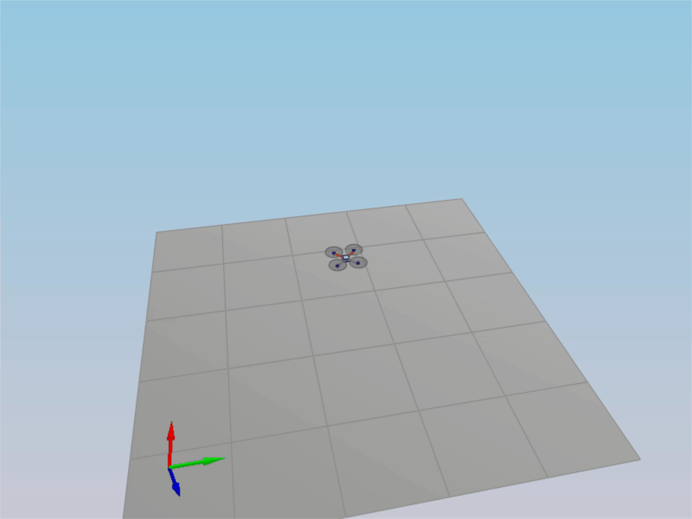
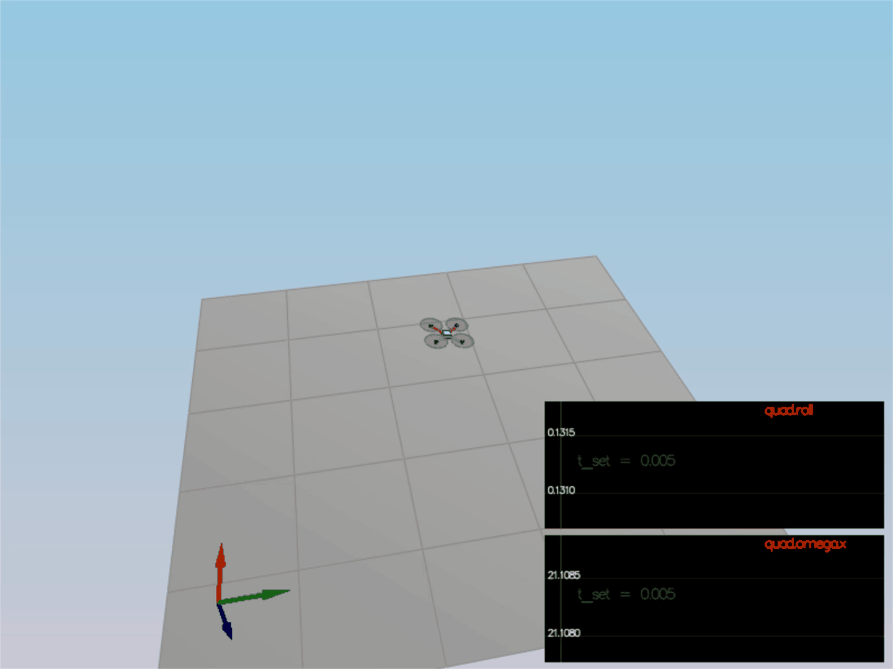

# README - 3D Drone Controller #

For easy navigation throughout this document, here is an outline:

 - [Development environment setup](#development-environment-setup)
 - [Simulator walkthrough](#simulator-walkthrough)
 - [Implementation details](#implementation-details)
 - [Evaluation](#evaluation)
 - [References](#references)


## Development Environment Setup ##

Regardless of your development platform, the first step is to download or clone this repository.

Once you have the code for the simulator, you will need to install the necessary compiler and IDE necessary for running the simulator.

Here are the setup and install instructions for each of the recommended IDEs for each different OS options:

### Windows ###

For Windows, the recommended IDE is Visual Studio.  Here are the steps required for getting the project up and running using Visual Studio.

1. Download and install [Visual Studio](https://www.visualstudio.com/vs/community/)
2. Select *Open Project / Solution* and open `<simulator>/project/Simulator.sln`
3. From the *Project* menu, select the *Retarget solution* option and select the Windows SDK that is installed on your computer (this should have been installed when installing Visual Studio or upon opening of the project).
4. Make sure platform matches the flavor of Windows you are using (x86 or x64). The platform is visible next to the green play button in the Visual Studio toolbar:


5. To compile and run the project / simulator, simply click on the green play button at the top of the screen.  When you run the simulator, you should see a single quadcopter, falling down.


### OS X ###

For Mac OS X, the recommended IDE is XCode, which you can get via the App Store.

1. Download and install XCode from the App Store if you don't already have it installed.
2. Open the project from the `<simulator>/project` directory.
3. After opening project, you need to set the working directory:
  1. Go to *(Project Name)* | *Edit Scheme*
  2. In new window, under *Run/Debug* on left side, under the *Options* tab, set Working Directory to `$PROJECT_DIR` and check ‘use custom working directory’.
  3. Compile and run the project. You should see a single quadcopter, falling down.


### Linux ###

For Linux, the recommended IDE is QtCreator.

1. Download and install QtCreator.
2. Open the `.pro` file from the `<simulator>/project` directory.
3. Compile and run the project (using the tab `Build` select the `qmake` option.  You should see a single quadcopter, falling down.

**NOTE:** You may need to install the GLUT libs using `sudo apt-get install freeglut3-dev`


### Advanced Versions ###

These are some more advanced setup instructions for those of you who prefer to use a different IDE or build the code manually.  Note that these instructions do assume a certain level of familiarity with the approach and are not as detailed as the instructions above.

#### CLion IDE ####

For those of you who are using the CLion IDE for developement on your platform, we have included the necessary `CMakeLists.txt` file needed to build the simulation.

#### CMake on Linux ####

For those of you interested in doing manual builds using `cmake`, we have provided a `CMakeLists.txt` file with the necessary configuration.

**NOTE: This has only been tested on Ubuntu 16.04, however, these instructions should work for most linux versions.  Also note that these instructions assume knowledge of `cmake` and the required `cmake` dependencies are installed.**

1. Create a new directory for the build files:

```sh
cd 3d-drone-controller
mkdir build
```

2. Navigate to the build directory and run `cmake` and then compile and build the code:

```sh
cd build
cmake ..
make
```

3. You should now be able to run the simulator with `./CPPSim` and you should see a single quadcopter, falling down.

## Simulator Walkthrough ##

Now that you have all the code on your computer and the simulator running, let's walk through some of the elements of the code and the simulator itself.

### The Code ###

For the project, the majority of your code is written in `src/QuadControl.cpp`.  This file contains all of the code for the controller.

All the configuration files for your controller and the vehicle are in the `config` directory.  For example, for all your control gains and other desired tuning parameters, there is a config file called `QuadControlParams.txt`.  An import note is that while the simulator is running, you can edit this file in real time and see the effects the changes have on the quad!

The syntax of the config files is as follows:

 - `[Quad]` begins a parameter namespace.  Any variable written afterwards becomes `Quad.<variablename>` in the source code.
 - If not in a namespace, you can also write `Quad.<variablename>` directly.
 - `[Quad1 : Quad]` means that the `Quad1` namespace is created with a copy of all the variables of `Quad`.  You can then overwrite those variables by specifying new values (e.g. `Quad1.Mass` to override the copied `Quad.Mass`).  This is convenient for having default values.

The simulator is used to fly some difference trajectories to test out the performance of the C++ implementation of the controller. These trajectories, along with supporting code, are found in the `traj` directory of the repo.


### The Simulator ###

In the simulator window itself, you can right click the window to select between a set of different scenarios that are designed to test the different parts of the controller.

The simulation (including visualization) is implemented on a single thread.  This is to allow setting breakpoints in the code at any point safetly and debug, without affecting any part of the simulation.

Due to deterministic timing and careful control over how the pseudo-random number generators are initialized and used, the simulation should be exactly repeatable. This means that any simulation with the same configuration should be exactly identical when run repeatedly or on different machines.

Vehicles are created and graphs are reset whenever a scenario is loaded. When a scenario is reset (due to an end condition such as time or user pressing the ‘R’ key), the config files are all re-read and state of the simulation/vehicles/graphs is reset -- however the number/name of vehicles and displayed graphs are left untouched.

When the simulation is running, you can use the arrow keys on your keyboard to impact forces on your drone to see how your controller reacts to outside forces being applied.

#### Keyboard / Mouse Controls ####

There are a handful of keyboard / mouse commands to help with the simulator itself, including applying external forces on your drone to see how your controllers reacts!

 - Left drag - rotate
 - X + left drag - pan
 - Z + left drag - zoom
 - arrow keys - apply external force
 - C - clear all graphs
 - R - reset simulation
 - Space - pause simulation


## Implementation Details ##


### Hover (scenario 1) ###

Tune the weight parameter of the quadrotor and set it as below
```
Mass = 0.485
```

With the proper mass, the simulation looks like this:

<p align="center">

</p>

A similar implementation in python can be found here [Python controller code](https://github.com/udacity/FCND-Controls/blob/solution/controller.py) as a reference.

#### Notes on Parameter Tuning
1. **Comparison to Python**: Note that the vehicle to be controlled in this portion of the project has different parameters than the vehicle that's controlled by the Python code linked above. **The tuning parameters that work for the Python controller do not work for this controller**

2. **Parameter Ranges**: You can find the vehicle's control parameters in a file called `QuadControlParams.txt`.

3. **Parameter Ratios**: In this [one-page document](https://www.overleaf.com/read/bgrkghpggnyc#/61023787/) you can find a derivation of the ratio of velocity proportional gain to position proportional gain for a critically damped double integrator system. The ratio of `kpV / kpP` should be 4.

### Body rate and roll/pitch control (scenario 2) ###

`Scenario 2` is used here. In this scenario, you will see a quad above the origin.  It is created with a small initial rotation speed about its roll axis.  The controller needs to stabilize the rotational motion and bring the vehicle back to level attitude.

To accomplish this, the following controllers are implemented:

1. Implement body rate control

 - `GenerateMotorCommands()`: here the moments required to achieve the target roll, pitch and yaw are calculated and these values are used to set the thrust values for each rotor.
 - `BodyRateControl()`: This is a simple P contoller that uses `kpPQR` target body rate values and current body rates to calculate the updated rates.
 - `kpPQR` in `QuadControlParams.txt` is tuned to get the vehicle to stop spinning quickly but not overshoot.

The rotation of the vehicle about roll (omega.x) will get controlled to 0 while other rates remain zero.  Note that the vehicle will keep flying off quite quickly, since the angle is not yet being controlled back to 0.  Also note that some overshoot will happen due to motor dynamics.

2. Implement roll / pitch control

 - `RollPitchControl()`: This is a P controller that uses the rotational matrix derived from the vehicle attitude, `kpBank` and target acceleration to get the desired body rates.
 - `kpBank` in `QuadControlParams.txt` is tuned to minimize settling time but avoid too much overshoot.

The quad levels itself (as shown below). You should also see the vehicle angle (Roll) get controlled to 0.

<p align="center">

</p>


### Position/velocity and yaw angle control (scenario 3) ###

This scenario additionally requires position, altitude and yaw control for your quad. For the simulation, `Scenario 3` is used.  This will create 2 identical quads, one offset from its target point (but initialized with yaw = 0) and second offset from target point but yaw = 45 degrees.

 - `LateralPositionControl()`: This is a PD controller on the commanded horizontal acceleration using commanded position and velocity and current position and velocity.
 - `AltitudeControl()`: This is a PID controller on the total of the quadrotor based on feed forward acceleration, vehicle attitude and commanded and current position and velocity on the z-axis.
 - Parameters `kpPosZ` and `kpPosZ` are tuned.
 - Parameters `kpVelXY` and `kpVelZ` and tuned.

The quads should go to their destination points and tracking error should be going down (as shown below). However, one quad remains rotated in yaw.

 - `YawControl()`: A P controller based on desired yaw and current yaw is used.
 - Parameters `kpYaw` and the 3rd (z) component of `kpPQR` are tuned.

Position control is tuned for mimizing settling time. Don’t try to tune yaw control too tightly, as yaw control requires a lot of control authority from a quadcopter and can really affect other degrees of freedom. This is why you often see quadcopters with tilted motors for better yaw authority! For a second order system, such as the one for this quadcopter, the velocity gain (`kpVelXY` and `kpVelZ`) should be at least ~3-4 times greater than the respective position gain (`kpPosXY` and `kpPosZ`).

<p align="center">

</p>

### Non-idealities and robustness (scenario 4) ###

This part explores some of the non-idealities and robustness of a controller. For this simulation, we will use `Scenario 4`.  This is a configuration with 3 quads that are all are trying to move one meter forward. However, this time, these quads are all a bit different:
 - The green quad has its center of mass shifted back.
 - The orange vehicle is an ideal quad.
 - The red vehicle is heavier than usual.

The integral control, and other control parameters in `QuadControlParams.txt` are tuneduntil all the quads successfully move properly. The drones' motion should look like this:

<p align="center">

</p>


### Tracking trajectories (scenario 5) ###

Here all the parts are put to test together on it's performance on a trajectory. This simulation uses `Scenario 5`. This scenario has two quadcopters:
 - the orange one is following `traj/FigureEight.txt`
 - the other one is following `traj/FigureEightFF.txt` - for now this is the same trajectory.

Parameters in `QuadControlParams.txt` are tuned so that the drone follows the 'tilted 8' shaped trajectories defined in the files stated above.

## Evaluation ##

To assist with tuning of your controller, the simulator contains real time performance evaluation.  We have defined a set of performance metrics for each of the scenarios that your controllers must meet for a successful submission.

There are two ways to view the output of the evaluation:

 - in the command line, at the end of each simulation loop, a **PASS** or a **FAIL** for each metric being evaluated in that simulation
 - on the plots, once your quad meets the metrics, you will see a green box appear on the plot notifying you of a **PASS**


### Performance Metrics ###

The specific performance metrics are as follows:

 - scenario 2
   - roll should less than 0.025 radian of nominal for 0.75 seconds (3/4 of the duration of the loop)
   - roll rate should less than 2.5 radian/sec for 0.75 seconds

 - scenario 3
   - X position of both drones should be within 0.1 meters of the target for at least 1.25 seconds
   - Quad2 yaw should be within 0.1 of the target for at least 1 second


 - scenario 4
   - position error for all 3 quads should be less than 0.1 meters for at least 1.5 seconds

 - scenario 5
   - position error of the quad should be less than 0.25 meters for at least 3 seconds

### References ###
* [Drone controller implementation in python](https://github.com/udacity/FCND-Controls/blob/solution/controller.py) is a helpful reference implementation.
* Euler's Rotation Equation: https://en.wikipedia.org/wiki/Euler%27s_equations_(rigid_body_dynamics%29.
* [Representing Attitude: Euler Angles, Unit Quaternions, and Rotation Vectors](https://www.astro.rug.nl/software/kapteyn-beta/_downloads/attitude.pdf) is a very thorough exploration of attitude representations. Equation 79 in that paper corresponds to the equation shown in the video above.
* [Feasibility of Motion Primitives for Choreography](http://flyingmachinearena.org/wp-content/publications/2011/schoellig_feasibility_of_motion_primitives.pdf) is a good summary for understanding quadrotor dynamics.
* [Feed-Forward Parameter Identification](http://www.dynsyslab.org/wp-content/papercite-data/pdf/schoellig-acc12.pdf) contains the equations for the controllers.


### Authors ###

Thanks to Fotokite for the initial development of the project code and simulator.
